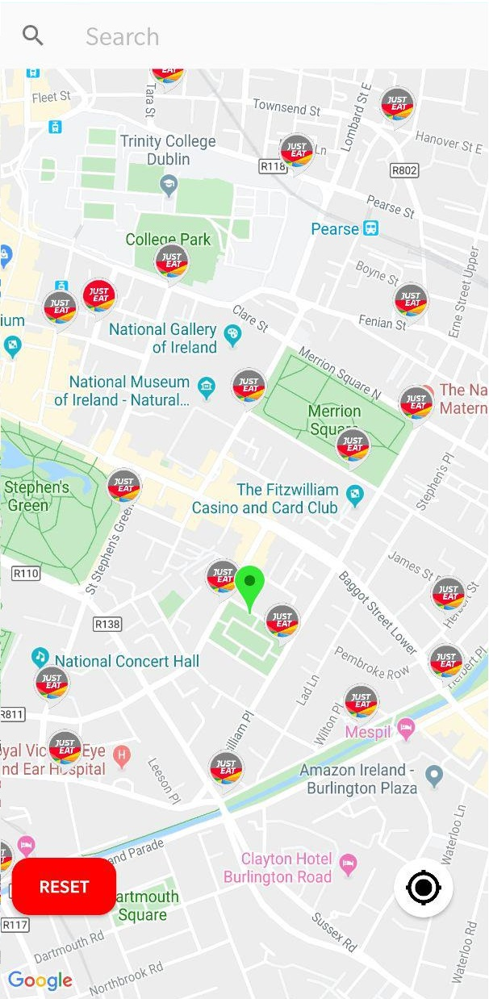

# Dublin Bikes Route Finder

Helps in finding a route between 2 bike stands (Stand1 -> Stand2) using live user location and open API.

[Dublin bikes open data API](https://developer.jcdecaux.com/#/opendata/vls?page=getstarted)

Use case diagram:

UI screenshots:

&nbsp;

